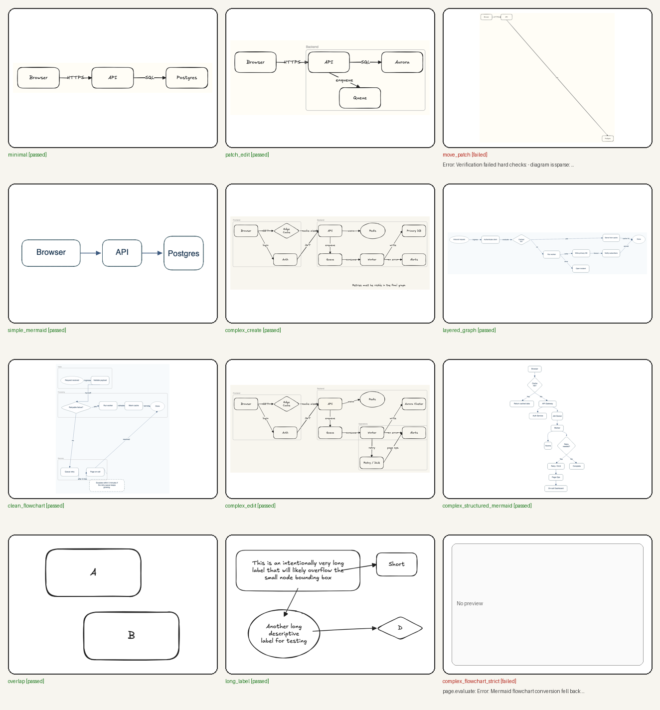
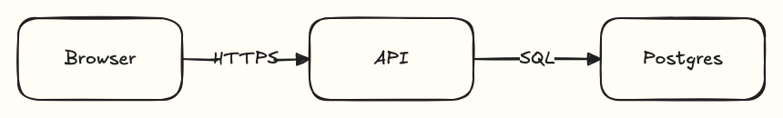
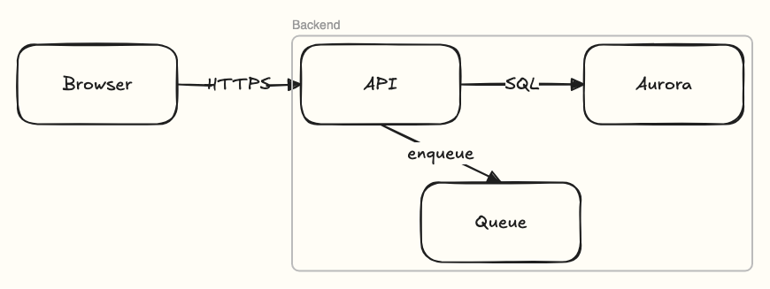
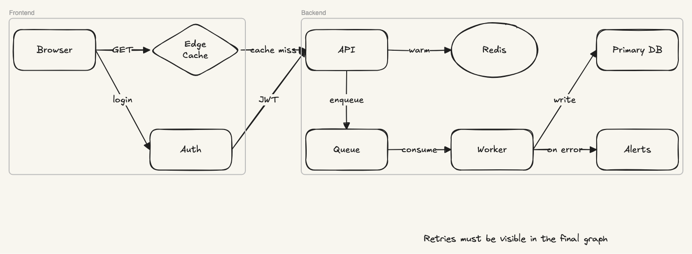
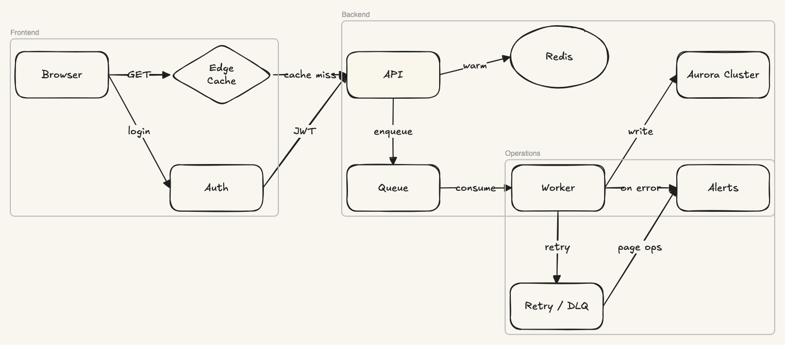
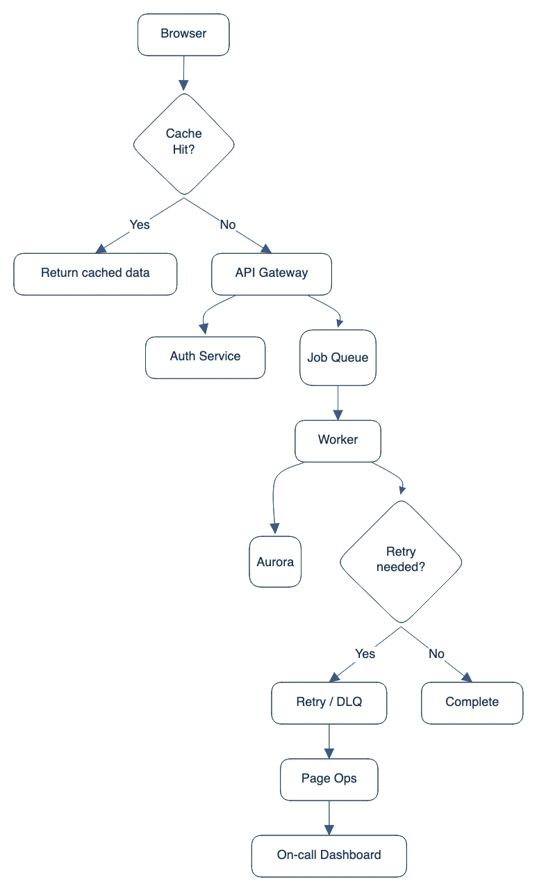
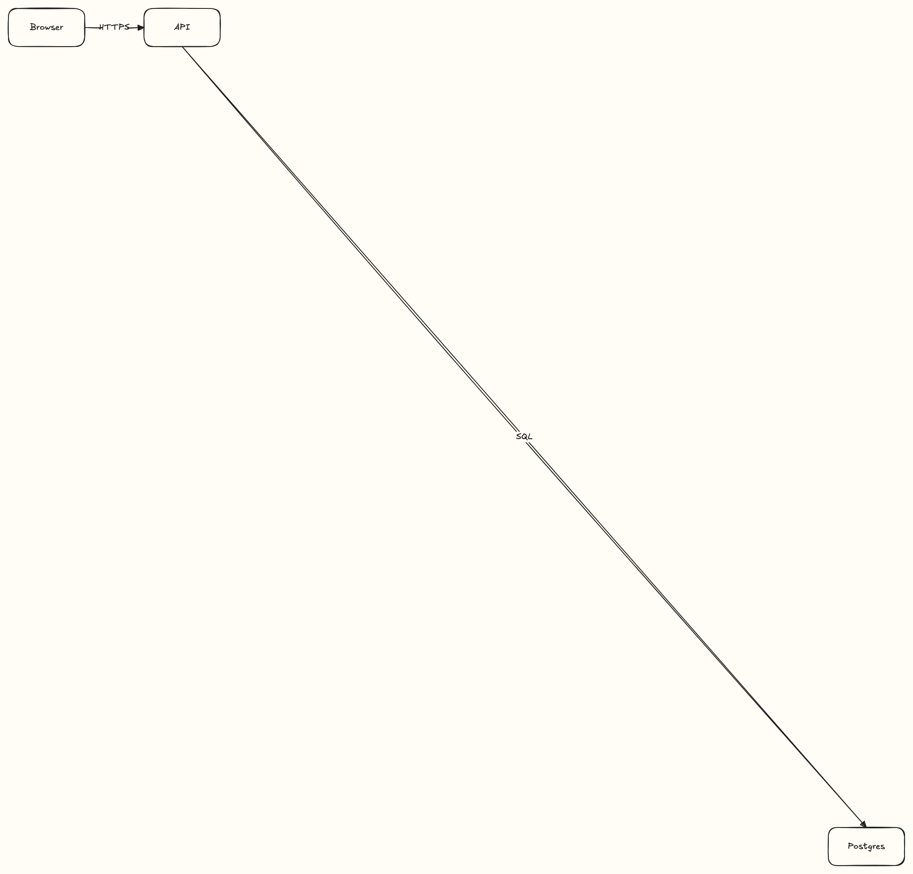
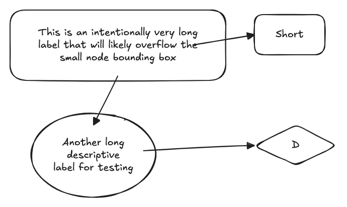

# Excalidraw Diagram Skill

This skill creates, edits, repairs, inspects, verifies, and exports Excalidraw diagrams. It is built for file-oriented Excalidraw work: `.excalidraw` scenes, Mermaid conversion, SVG export, and screenshot-based visual verification.

## What It Can Do

- Create a new diagram from a compact scene spec.
- Edit an existing `.excalidraw` scene with patch operations.
- Repair malformed or partially broken scenes.
- Convert Mermaid flowcharts into editable Excalidraw output.
- Export SVG and capture a preview screenshot for visual QA.
- Surface quality warnings when a diagram is sparse, crowded, detached, or otherwise suspicious.

## Example Outputs

### Contact Sheet



### Clean Examples

`minimal`



`patch_edit`



`complex_create`



`complex_edit`



`complex_structured_mermaid`



## Warning Examples

These fixtures are useful because they prove the verifier catches layout and fidelity issues instead of silently passing them.

`move_patch`



Expected warning: sparse / sprawled layout.

`long_label`



Expected warning: crowded label in a container.

## Example Commands

Create a scene from a compact scene spec:

```bash
npx tsx scripts/create_scene.ts \
  --spec scripts/tests/fixtures/minimal_spec.json \
  --out /tmp/minimal.excalidraw \
  --export-svg /tmp/minimal.svg \
  --preview /tmp/minimal.preview.png \
  --verify
```

Edit an existing scene with a patch:

```bash
npx tsx scripts/edit_scene.ts \
  --scene scripts/tests/fixtures/minimal_scene.excalidraw \
  --patch scripts/tests/fixtures/patch_spec.json \
  --out /tmp/patched.excalidraw \
  --export-svg /tmp/patched.svg \
  --preview /tmp/patched.preview.png \
  --verify
```

Convert Mermaid to Excalidraw:

```bash
npx tsx scripts/convert_mermaid.ts \
  --input scripts/tests/fixtures/complex_structured_flowchart.mmd \
  --out /tmp/complex-structured-flowchart.excalidraw \
  --export-svg /tmp/complex-structured-flowchart.svg \
  --preview /tmp/complex-structured-flowchart.preview.png \
  --verify
```

Inspect or repair a scene:

```bash
npx tsx scripts/inspect_scene.ts --scene scripts/tests/fixtures/broken_scene.excalidraw
npx tsx scripts/repair_scene.ts --scene scripts/tests/fixtures/broken_scene.excalidraw --out /tmp/repaired.excalidraw
```

## Validation

Run the full skill validator:

```bash
python3 scripts/quick_validate.py .
```

Build a fresh gallery manifest, previews, and contact sheet:

```bash
python3 scripts/build_gallery.py .
```

The gallery builder writes:

- `test-artifacts/gallery/gallery-summary.json`
- `test-artifacts/gallery/fixture-contact-sheet.png`

## Notes

- This skill is for diagram files and exports, not React or Next.js embedding.
- Mermaid conversion is flowchart-only. If the input is a sequence, class, state, gantt, or other non-flowchart Mermaid family, the tool refuses and points you to SceneSpec instead.
- Verification is intentionally visual as well as structural: it exports, screenshots, and checks the result before treating output as clean.
